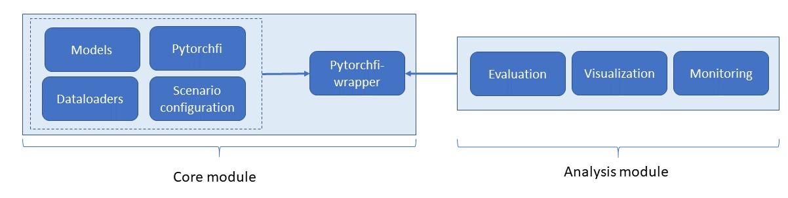
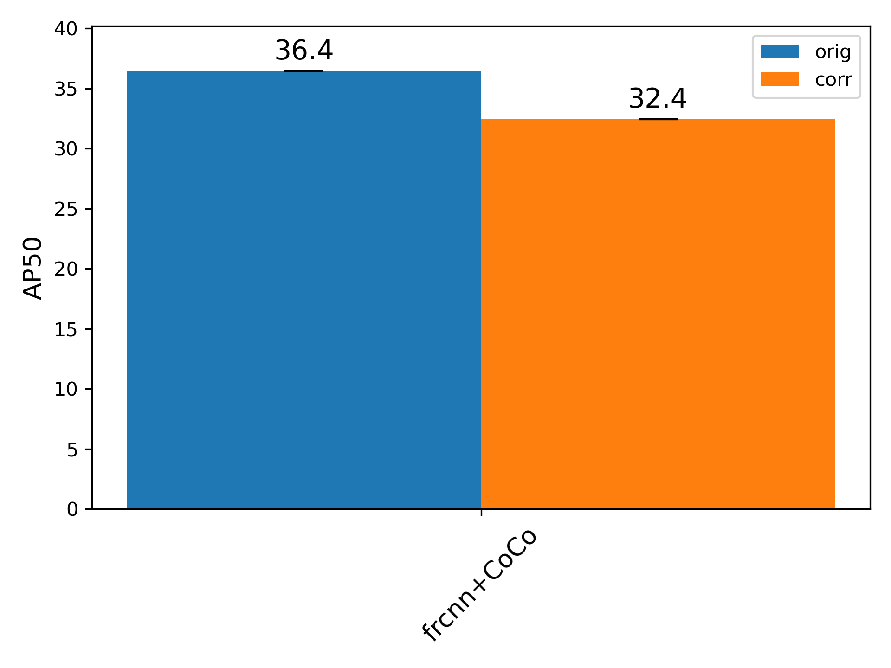
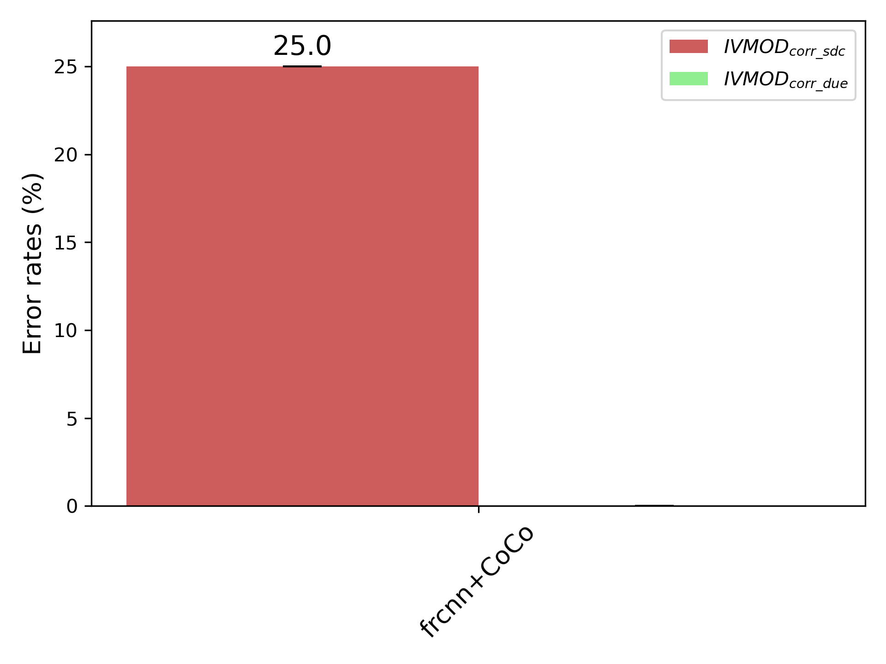

# Pytorch application-level fault injector (pytorch-Alfi)

## Overview

This tool uses the pytorchfi fault injector by University of Illinois, extends it and adds additional functionality for convenient fault scenario configuration, dataloader wrapping, test evaluation visualization and monitoring. If you are looking for the original pytorchfi please look [here](https://github.com/pytorchfi/pytorchfi).
The fault injector tool consists of a **core module** which contains all the functionality to perform a minimum automated fault injection campaign into a given model applied to a given image dataset. Among the different components in the core module, the alficore unit integrates the specified information about model, data set, and fault scenario, and provides the user-executable functions to run the campaign. 

Besides the core unit, the tool provides additional resources for a deeper analysis of the fault injection experiment, which we summarize as **analysis module**. Those features can help to develop a better understanding the behavior of the network in the presence of faults. The analysis module is a collection of both general features (for example, the possibility to monitor the occurrences of specific values such as not-a-number (nan) or infinity (inf)) and application-specific convenience features (for example the evaluation and visualization of the output for object detection workloads). 
When enabled, the analysis features are automatically integrated through the Alfi-Core unit of the core module, that acts as an interface between the core module and the analysis module.
The [Fig. 1](#Schematic) gives an overview of this structure.

<p align="center">
<!--  -->

</p>
<figcaption align = "center"><b> Fig. 1: Pytorch-ALFI System overview </b></figcaption>

## Process flow

The workflow is as follows:
- In the scenario.yaml: Specify the type and scope of the injected faults
- In the main file: 
  - Select an available model and dataset
  - If needed: Adjust pre- and post-processing of model in build_native_model class
  - Create a test script (see demo1.py as an example)
  - If needed: Specify parameters related to desired analysis functions
  - Run experiment by instantiating `TestErrorModels_ObjDet` for object detection models or `TestErrorModels_ImgClass`for image classification.
  - run test by calling the function `test_rand_ObjDet_SBFs_inj()` or `test_rand_ImgClass_SBFs_inj()` respectively

The tool will then create a copy of the original model for fault injection, run them sequentially with exactly the same input data and store the results as json files.  

The output of the experiment will be saved in the form of:
- A original bin file fault.bin containing the sampled faults
  - A corresponding detailed updated runset bin file (corr/resil*_updated_rs_fault_locs.bin) which contains faults used during specific fault campaign (normal corruption/corruption-with-resiliency-methods).
  - These detailed bin files can be used to trace faults used for a particular image. if num_runs=2, and sample images selected by dataloader is 50, then these updated bin files will consists of 100 rows, where first 50 rows correspond to first epoch of experiment and next 50 rows for second run. Similarly the original bin file will also contain 100 rows but with limited info; only related to fault locations.  Each row consists of the following:
    - -fault_bin column = [[original fault location 7 elements], bit-flip direction (monitor), orig value, corr value, total ranger_detections - IF APPLIED] <br />
    --- [original fault location 7 elements] => Meaning for NEURON injection: --- # <br />
          # 1. batchnumber (used in: conv2d,conv3d)  <br />
          # 2. layer (everywhere) <br />
          # 3. channel (used in: conv2d,conv3d) <br />
          # 4. depth (used in: conv3d) <br />
          # 5. height (everywhere) <br />
          # 6. width (everywhere) <br />
          # 7. value (everywhere) <br />
      --- [original fault location 7 elements] => Meaning for WEIGHT injection: --- # <br />
          # 1. layer (everywhere) <br />
          # 2. Kth filter (everywhere) <br />
          # 3. channel(used in: conv2d, conv3d) <br />
          # 4. depth (used in: conv3d) <br />
          # 5. height (everywhere) <br />
          # 6. width (everywhere) <br />
          # 7. value (everywhere) <br />
- A result.json containing the output of the network in the absence of faults
- A result_corr.json containing the raw output of the model with faults


## Scope
Current constraints for the use of the tool are:
- Input has the form of images (i.e. 3-dimensional arrays)
- Model has convolutional or fully connected layers in the form of Pytorch modules
- For monitoring: Model features supported activation layers in the form of Pytorch modules 

## Integration Example

The file `demo1.py` gives an example of how to integrate pytorchalfi into a test scenario. The following things need to be prepared in advance:
- a scenario configuration (see section [Scenario configuration](#scenario-configuration))
- a model where faults should be injected (see section [Models](#models))
- a specially prepared dataloader (see section [Dataloaders](#dataloaders))

The scripts takes a number of command line parameters. Run `python demo1.py -h` to see the following help:

```
usage: demo1.py [-h] --dl-json DL_JSON --dl-img-root DL_IMG_ROOT --dl-ds-name DL_DS_NAME [--config-file CONFIG_FILE] [--fault-files FAULT_FILES] [--dl-batchsize DL_BATCHSIZE] [--sample-size SAMPLE_SIZE] [--num-workers NUM_WORKERS] [--device DEVICE] [--random-sample]
                [--shuffle]

optional arguments:
  -h, --help            show this help message and exit
  --dl-json DL_JSON     path to dataloader json file
  --dl-img-root DL_IMG_ROOT
                        path to dataloader images
  --dl-ds-name DL_DS_NAME
                        dataset short name
  --config-file CONFIG_FILE
                        name of default yml file - inside scenarios folder
  --fault-files FAULT_FILES
                        directory of already existing fault files
  --dl-batchsize DL_BATCHSIZE
                        dataloader batch size
  --sample-size SAMPLE_SIZE
                        dataloader sample size
  --num-workers NUM_WORKERS
                        dataloader number of workers
  --device DEVICE       cuda device, i.e. 0 or 0,1,2,3 or cpu
  --random-sample       show results
  --shuffle             dataloader shuffle
  ```

`DL_JSON` is the dataloader description file in json format. If your dataloader labels are provided in text format section [Dataloaders](#dataloaders) explains how to create a json version. The following 3 parameters are mandatory. `DL_IMG_ROOT` is the path to where all images of the dataloader reside. Our tool assumes that there is only one directory for image files and that different sub-sets for training, test and validation are configured using separate json files. `DL_DS_NAME` is the short name of the dataset you plan to use. For example dataloaders that are provided with this tool you can look up available short names in the file `alficore/wrapper/test_error_models_objdet.py` and `alficore/wrapper/test_error_models_imgclass.py` respectively in function ` __ptfi_dataloader`. You can define your own as described in [Dataloaders](#dataloaders).
If `CONFIG_FILE` is given this file is used for scenario configuration (see section [Scenario configuration](#scenario-configuration)). If not given the file `default.yml` is used. Config files must be placed in directory `scenarios`. An example file can be found in `alficore/scenarios/default.orig`. `FAULT_FILES` is the path to an existing fault file. The following parameters are common configuration settings for the dataloader and should be self-explanatory. 

We now explain the main function. 

First the model is initiated:

```
frcnn_model = faster_rcnn.fasterrcnn_resnet50_fpn(weights=faster_rcnn.FasterRCNN_ResNet50_FPN_Weights.DEFAULT)
frcnn_model = frcnn_model.to(device)
frcnn_model.eval()
model = build_objdet_native_model(model=frcnn_model)

```
You are free to open the model any way you like. In this example we are using the FasterRCNN model. 
Next a value object of type `TEM_Dataloader_attr` is created that collects all parameters for the dataloader in one place.

```
dl_attr = TEM_Dataloader_attr()
dl_attr.dl_random_sample  = opt.random_sample
dl_attr.dl_batch_size     = opt.dl_batchsize
dl_attr.dl_shuffle        = opt.shuffle
dl_attr.dl_sampleN        = opt.sample_size
dl_attr.dl_num_workers    = opt.num_workers
dl_attr.dl_device         = device
dl_attr.dl_dataset_name   = opt.dl_ds_name
dl_attr.dl_img_root       = opt.dl_img_root
dl_attr.dl_gt_json        = opt.dl_json
```
For greater convenience and fine grain control about input and output data into and from your model an additional wrapper class `build_objdet_native_model` is applied. The wrapper behaves like the original model through the use of the `__getattr__` and `__call__` functions. You find the code in the same script. This wrapper class provides functions to pre-process input (e.g. if you want to furtner modify/augment your input images) and postprocess input. This function is important for the evaluation of the results of the fault injection. Please see the `__call__` function on how the pre- and postprocessing functions are invoked. Please observe in particular this code block in the postpocess function.

```
Output, nms_indx = self.non_max_suppression(output)
out_list = []
for idx, output in enumerate(Output): # for each image in batch
    if output:
        out_instance = Instances(self.img_size, fields_len_check=False)
        out_instance.set("image_id", input[idx]["image_id"])
        boxes = rescale_bounding_boxes(output=Output[idx]['boxes'])
        out_instance.set("pred_boxes", boxes)
        out_instance.set("pred_classes", Output[idx]['labels'])
        out_instance.set("scores", Output[idx]['scores'])
    else:
        out_instance = Instances(self.img_size, fields_len_check=False)
        out_instance.set("image_id", input[idx]["image_id"])
        out_instance.set("pred_boxes", None)
        out_instance.set("pred_classes", None)
        out_instance.set("scores", None)
    out_list.append({'instances': out_instance})
```

Here an array of type `Instances` is created which receives important results that should be stored for later evaluation. The data is stored as a set of json files. The location of those files will be logged to the command line. But in general they will be stored under `/result_files/output_<timestamp>...` For details on evaluation please see section [Evaluation](#evaluation).

The actual fault injection object is created by instantiating `TestErrorModels_ObjDet`.
```
frcnn_Errormodel = TestErrorModels_ObjDet(model=wrapped_model, resil_model=None, resil_name=None, model_name=model_name, config_location=opt.config_file, \
                ranger_bounds=None, device=device,  inf_nan_monitoring=True, disable_FI=False, dl_attr=dl_attr, num_faults=0, fault_file=fault_files, \
                    resume_dir=None, copy_yml_scenario = False)
```
Most parameters were previously set through the command line. The parameters starting with "resil" and "ranger" can be ignored in this opensource version and should be set to None. Please contact the authors if you would like to learn more about this functionality. The parameter `disable_FI` if set to true will prevent any faults being injected and no faulty model will be created. If it is set to True than a copy of the original model will be generated. Both models will be run in sequence and 

## Components of the Core Unit
### Scenario configuration

Scenario configuration is done using yaml files in the top level directory `scenarios`. Please don't confuse with the `scenarios` folder inside `alficore`. The latter only contains a template as example. The existing yaml file contains detailed documentation. Therefore we only give a high level overview of the different sections in the file. 
The **Basic Wrapper configuration** section contains some conveniency settings that are not mandatory. Faults that are applied to a model are stored in binary form and can be read using pickle. After that the data is available as dictionary. It is usually not necessary to open the file manually. The setting `fi_logfile`and `read_from_file` are related to this. The first gives a custom name when storing that file and the second loads existing faults to be reapplied to test scenarios.

The **definition of FI scenario** section prepares the correct number of faults to be injected for the chosen rnd_mode of either `weights` or `neurons`. The faults are pre-created at the very beginning before the actual fault injection run to save compute time and to be able to reuse exactly the same faults for different runs. With same faults we mean the "address" of the fault within the network (either in neurons or weights) and also its bit position is the same. The 2 parameters `dataset_size` and `num_runs` don't have to be taken too literally. They just determine the number of pre-defined faults as the product $dataset\_size\times  num\_runs$. `max_faults_per_image` does just that, setting the number of faults that are applied in each image.

**types of layers supported** lets you select either a single layer type of a combination of several using a comma separated list in square brackets. 

**Random fault definition** is the most important section. Here you can fine tune the location of faults and if the same fault is repeated over several images or not. `rnd_mode` defines whether faults are injected into neurons or weights of a model. You can only select one of neurons or weights at a time. `inj_policy` defines how often the fault position is changed, for every image for each batch or for each epoch. This setting now superceeds the settings for `rnd_batch`, `rnd_layer`, `rnd_location` and `rnd_value` which should always be kept to `change`. `rnd_value_type` represents the fault characteristic like bitflip or stuck_at faults. `rnd_value_bits` gives the number of bits in your values (quantization) while `rnd_bit_range` allows to specifiy the range in which a bit is randomly flipped. 

Finally **PytorchFI parameters** only contain settings for input image dimensions.

### Models

### Dataloaders
Current data loader examples focus on image data sets only. Dataloaders are enhanced to allow capturing additional information during fault injection runs. The minimal information stored about each image are directory+filename, height, width and image id. This can be extended to individual needs. For a consistent handling of different datasets each dataset is brought into a json format as used in the CoCo dataset first. An example for converting text based labels to json based labels is presented in the example script `utils/kitti-2_coco_labels.py`. For object detection datasets please take note of the bounding box coordinate encoding that is used in the final json file. The different versions of BB encodings can be found in the file `Alfi-Core/dataloader/objdet_baseClasses/boxes.py`. 
Training, test and validation datasets can be configured in different json files. There is a script called `utils/split_data.py` that gives an example on how to create separate json files from one overall json file. For the later fault injection run only one of those files is used and need to be given as input parameter as explained in section [Integration Example](#integration-example).
Dataloader examples are part of `Alfi-Core`. They can be found in directory `Alfi-Core/dataloader`. The file `abs_loader.py`contains an abstract dataloader class. Most functions can be overwritten and adjusted to the own needs. One function called `load_json` must be defined for each dataloader because it takes care of preparing the dataset dictionary. Examples can be found in `Alfi-Core/dataloader/coco_loader` and `Alfi-Core/dataloader/coco_loader`. 
The dataloaders are called in the files `Alfi-Core/wrapper/test_error_models_objdet.py` and `Alfi-Core/wrapper/test_error_models_imgclass.py` respectively. The first is used for object detection and the second for classification. Check the function ` __ptfi_dataloader` in either file for details.

### Pytorchfi

The Pytorchfi module contains the already mentioned modified version of the pytorchfi fault injector by the University of Illinois from [here](https://github.com/pytorchfi/pytorchfi). It provides the actual injection functionality into neural networks. It is not necessary to call code from this module directly.

### Alficore

The alficore module contains our wrapper to pytorchfi and the analysis components. The main entry point are the two files `alficore/wrapper/test_error_models_imgclass.py` and `alficore/wrapper/test_error_models_objdet.py`. Please see section [Integration Example](#integration-example) for an example on how to use them.

## Analysis Components

### Evaluation
- **Image classification model evaluation:**
  <br />
- **Object detection model evaluation:**

  In this section we'll see how to evaluate a fault injection experiment using the demo1.py (ex: faster-rcnn model). As explained in [Process flow](#Process-flow), running the demo1.py file creates the results files in a model specific dedicated folder containing fault locations. As an example, we have uploaded these result files to show the primary evaluation (see dir ./result_files/VPU_test/frcnn_torchvision_1_trials..). The evaluation metric depends on the application and the research problem one is keen to look into. In case of object detection models, currently we have CoCo-API and IVMOD (Image-wise vulnerability of object detection models) metric to compute the vulnerability of the models. The IVMOD metric was introduced in the 2022 paper <br />
  **"Hardware faults that matter: Understanding and Estimating the safety impact of hardware faults on object detection DNNs"  [1]**

  <p align="center">
  
  </p>
  <figcaption align = "center"><b> Fig. 2: Evaluation results using AP50 and IVMOD metric</b></figcaption>
  <br />

  **How to run evaluation:**
   
    The vulnerability of the model depends on the metric (refer paper for more details). These results are generated by   aggregating the vulnerability of the models using AP and IVMOD Metric and it is stored into a json file. This is achieved by running **../evaluation/sdc_plots/obj_det_analysis.py** file part of evaluation module in alficore. This file can take multiple experiments together to create the resultant json files parallelly. Later these generated json files (multiple experiments supported) is passed to **../evaluation/sdc_plots/obj_det_plot_metrics_all_models.py** file as a dictionary which then plots the above figures. We provided the above evaluation files as an example and this can be used to extend to compute and plot custom metrics. The results in the above mentioned paper are produced using pytorch-ALFI and is visualised using these evaluation files. To keep things simple for users's initial exploration, the above mentioned evaluation process can be easily reproduced by just running the files without much changes. It is developed to run out of the box for in-built metrics.
  <br />

- **Video examples of fault injection campaigns (for more details please refer the paper)**

  <br />
  <p align="center">
  
  
  </p>
    <figcaption align = "center"><b> Fig. 3: Permanent fault injected in YoloV3 + Lyft inference (top) and YoloV3 + Providentia++ inference (bottom)</b></figcaption>
    <br />
  - link to Providentia++ dataset
<!-- ### Visualization -->

# References:
   **[1]** Qutub, Syed, et al. "Hardware faults that matter: Understanding and Estimating the safety impact of hardware faults on object detection DNNs." International Conference on Computer Safety, Reliability, and Security. Springer, Cham, 2022.
    https://arxiv.org/abs/2209.03225
# Authors

Ralf Graefe: Ralf.Graefe@intel.com
Qutub Syed: Syed.Qutub@intel.com
Florian Geissler: Florian.Geissler@intel.com
