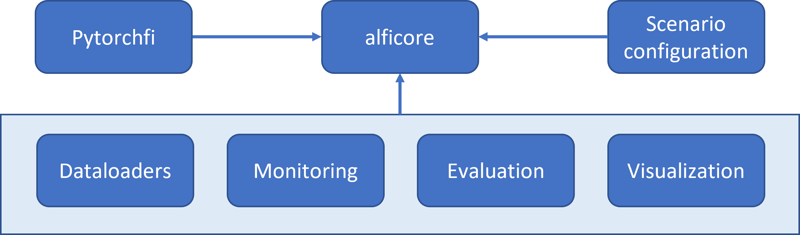

# Pytorch application-level fault injector (pytorch-Alfi)

## Overview

We present pytorch-ALFI, a tool to run hardware fault injection campaigns in pytorch in an automated and convenient way. We integrate the opensource pytorchfi fault injector component (see [References [1]](#references) or [here](https://github.com/pytorchfi/pytorchfi)) and add additional functionality for fine-granular and targeted fault scenario configuration, dataloader wrapping, test evaluation, visualization, and monitoring. Currently, we support the two use cases of **image classification** and **object detection**.
The [Fig. 1](#Schematic) gives an overview of the structure of pytorch-ALFI.

<p align="center">
<!--  -->

</p>
<figcaption align = "center"><b> Fig. 1: Pytorch-ALFI System overview </b></figcaption>
<br/><br/>

The core of the tool is the **alficore** component, which provides a test class that integrates all functionalities. The specifics of the fault injection campaign, such as fault model and number of injected faults, will be configured in the **scenario configuration** component. The **pytorchfi** component will take care of the fault injection execution. Alficore further provides multiple optional functionalities, in form of the components **Dataloaders** (provide a selection of simple-to-use dataloaders), **Monitoring** (functions to monitor the occurrence of not-a-number, NaN, or infinity, Inf, values), **Evaluation** (calculate SDC or DUE rates), and **Visualization** (plot key results, currently only for object detection). A detailed description of the workflow can be found in the next sections. To run a minimal example, the following demo scripts can be used.


### Minimal example for image classification:
This script runs a classification example of the model LeNet-5 on the MNIST dataset, injecting one neuron fault per image:
```
python demo_img_classification.py
```
You will get the results saved in a folder ```<path to result files>``` (see console print for exact location). For subsequent evaluation, enter this path in the evaluation file at evaluation/img_class_eval.py and run it:
 ```
python evaluation/img_class_eval.py
```
  
### Minimal example for object detection:
This script runs an object detection example of the model Faster-RCNN on the COCO dataset, injecting one neuron fault per image:
```
python demo_obj_detection.py
```
You will get the results saved in a folder ```<path to result files>```. For subsequent evaluation, enter this path in the evaluation files at evaluation/obj_det_analysis.py and evaluation/obj_det_plot_metrics_all_models.py, respectively, and run it:
```
python evaluation/obj_det_analysis.py
python evaluation/obj_det_plot_metrics_all_models.py
```

## System components

We here discuss the functional elements as illustrated in [Fig. 1](#Schematic).

### Scenario configuration

Scenario configuration is done using yaml files in the top level directory `scenarios`. Please don't confuse with the `scenarios` folder inside `alficore`. The latter only contains a template as example. The existing yaml file contains detailed documentation. Therefore we only give a high level overview of the different sections in the file. 
The **Basic Wrapper configuration** section contains some conveniency settings that are not mandatory. Faults that are applied to a model are stored in binary form and can be read using pickle. After that the data is available as dictionary. It is usually not necessary to open the file manually. The setting `fi_logfile`and `read_from_file` are related to this. The first gives a custom name when storing that file and the second loads existing faults to be reapplied to test scenarios and to repeat experiments.

The **definition of FI scenario** section prepares the number of faults to be injected during inference for the chosen rnd_mode of either `weights` or `neurons`. The faults are pre-created at the very beginning before the actual fault injection run to save compute time and to be able to reuse exactly the same fault locations for different runs. With same fault locations we mean the "address" of the fault within the network (either in neurons or weights) and also its bit position is the same. The parameter `num_runs` is used to repeat the fault injection cammpaign for N (epoch) number of times . It is also used to  determine the number of pre-defined faults as the product num\_runs$ and `max_faults_per_image`. `max_faults_per_image` is the , setting the number of faults that are applied in each image.

**types of layers supported** lets you select either a single layer type of a combination of several using a comma separated list in square brackets. 

**Random fault definition** is the most important section. Here you can fine tune the location of faults and if the same fault is repeated over several images or not. `rnd_mode` defines whether faults are injected into neurons or weights of a model. You can only select one of neurons or weights at a time. `inj_policy` defines how often the fault position is changed, for every image, for each batch or for each epoch. This setting now superceeds the settings for `rnd_batch`, `rnd_layer`, `rnd_location` and `rnd_value` which should always be kept to `change`. `rnd_value_type` represents the fault characteristic like bitflip or stuck_at faults. `rnd_value_bits` gives the number of bits in your values (quantization) while `rnd_bit_range` allows to specifiy the range in which a bit is randomly flipped. 

Finally **PytorchFI parameters** only contain settings for input image dimensions.


### Pytorchfi

The Pytorchfi module contains the already mentioned modified version of the pytorchfi fault injector [here](https://github.com/pytorchfi/pytorchfi). It provides the actual injection functionality into neural networks. It is not necessary to call code from this module directly.

### Alficore

The alficore module contains our wrapper to pytorchfi and the analysis components. The main entry point are the two files `alficore/wrapper/test_error_models_imgclass.py` and `alficore/wrapper/test_error_models_objdet.py`. Please see section [Integration Example](#integration-example) for an example on how to use them.


### Dataloaders
Current data loader examples focus on image data sets only. Dataloaders are enhanced to allow capturing additional information during fault injection runs. The minimal information stored about each image are directory+filename, height, width and image id. This can be extended to individual needs. For a consistent handling of different datasets each dataset is brought into a json format as used in the CoCo dataset first. An example for converting text based labels to json based labels is presented in the example script `utils/kitti-2_coco_labels.py`. For object detection datasets please take note of the bounding box coordinate encoding that is used in the final json file. The different versions of BB encodings can be found in the file `Alfi-Core/dataloader/objdet_baseClasses/boxes.py`. 
Training, test and validation datasets can be configured in different json files. There is a script called `utils/split_data.py` that gives an example on how to create separate json files from one overall json file. For the later fault injection run only one of those files is used and need to be given as input parameter as explained in section [Integration Example](#integration-example).
Dataloader examples are part of `Alfi-Core`. They can be found in directory `Alfi-Core/dataloader`. The file `abs_loader.py`contains an abstract dataloader class. Most functions can be overwritten and adjusted to the own needs. One function called `load_json` must be defined for each dataloader because it takes care of preparing the dataset dictionary. Examples can be found in `Alfi-Core/dataloader/coco_loader` and `Alfi-Core/dataloader/coco_loader`. We provide few wellknown dataloaders as examples which are optimized for pytorch-Alfi. This can be used as an example to develop dataloader for anyother dataset.
The dataloaders are called in the files `Alfi-Core/wrapper/test_error_models_objdet.py` and `Alfi-Core/wrapper/test_error_models_imgclass.py` respectively. The first is used for object detection and the second for classification. Check the function ` __ptfi_dataloader` in either file for details.

### Monitoring
Monitoring functions are optional but can be used to identify specific samples where, for example, non-numerical elements such as NaN or Inf were encountered or sample image which lead to maximum vulnerability. 

### Evaluation

Result files are stored in directories that reflect the paramters of the test run. The top level directory is set in the `scenarios\default.yml` file or similar using the parameter `save_fault_file_dir`. Per default it is `result_files`.  The next sub-directory is named \<ModelName\>\_\<number of runs\>\_"trials".  
Next we put the \<injection mode\> + "\_injs". Injection mode is either "neurons" or "weights".  Then follows the injection policy which can be either "per_image", "per_epoch", or "per_batch".  
After that follows a directory combining the string "objDet" or "imClass" for the type of model with a time stamp, the number of faults per injection and the bit-range in which was injected.  
Finally the dataset name and the dataset type (train, val or test) are appended.  Here is an example: "result_files/LeNet_orig_1_trials/neurons_injs/per_batch/imClass_20221024-144100_1_faults_[0,8]_bits/mnist/val/"

#### Image classification model evaluation  

For image classification, the test results are stored in csv files. Files can be found in the directory described above. Result file names are constructed as follows:
The model name + "_test_random_sbf_" + the injection type (either "neurons" or "weights") + "_inj". This is followed by the number of faults, the number of runs and the batch size + "bs". Finally the dataset and the string "results" or "results_golden" is attached. Here is an example showing that the original LeNet model was used with faults inejcted into neurons where 1 fault per image in 1 run and batch size 10 were used with the mnist dataset: "LeNet_orig_test_random_sbf_neurons_inj_1_1_10bs_mnist_results_golden.csv"

The golden csv file has the following structure:  
File path (depending on the used dataset might not be available and show -1), ground truth class, original output index - top5,original output score - top5,time - original model and some fields that are not relevant for the opensource version.  

The csv file showing the effect of the fault injection (_results_corr.csv) has the following structure:  
File path (depending on the used dataset might not be available and show -1), ground truth label, corrupted output index - top5, corrupted output score - top5, for fault position: layer,channel_in,channel_out,3D channel,height,width,bit,time - corrupted model and some fields that are not relevant for the opensource version.

To evaluate an image classification experiment, first enter the evaluation path (path to the results folder) in evaluation/eval_img_classification.py and run it:
```
python evaluation/eval_img_classification.py
```
This will print you the resulting accuracy, DUE rate, and SDC rate to the command line.

#### Object detection model evaluation

In this section we'll describe how to evaluate a fault injection experiment using the demo_obj_detection.py (ex: faster-rcnn model). As explained in [Process flow](#Process-flow), running the demo_obj_detection.py file creates the results files in a model specific dedicated folder containing fault locations as explained at the beginning of section [Evaluation](#evaluation). The evaluation metric depends on the application and the research problem one is keen to look into. In case of object detection models, currently we have CoCo-API and IVMOD (Image-wise vulnerability of object detection models) metric to compute the vulnerability of the models. The IVMOD metric was introduced in the 2022 paper (see [References [2]](#references))  

The demo file uses the Coco dataset. Due to its size we don't include it in this repository. Please download from [here](https://cocodataset.org/#download). For instance you can download the 2017 version of images and annotations. Use the parameters `--dl-json` and `--dl-img-root` to specify the locations of the anotation json and root directory for images respectively. 

The demo script already prints average precision and recall values to the command line. 

The location of result files is logged to the terminal when running the demo script. The directory is constructed as described at the beginning of section [Evaluation](#evaluation). Inside the results directory are 2 versions of the applied faults as .bin files. A yaml file contains the applied test parameters and the file `coco_format.json` the used dataset. The test metrics can be found in the sub-directories `corr_model` for the corrupted model results meaning results under the influence of injected faults and `orig_model` for the unmodified model. Below those are separate directories for each epoch run. There the file `oco_results_corr_model_\*.json` contains aggregated metric values while the file `coco_instances_results\*.json` contains model prediction results.  In the case of the demo these result values are `image_id, category_id, bounding box coordinates, bounding box mode and a category score`.
  
Additional tools for evaluation are provided in the directory `evaluation`. The vulnerability of the model depends on the metric (refer paper for more details). These results are generated by aggregating the vulnerability of the models using AP and IVMOD Metric and it is stored into a json file. This is achieved by 
entering the evaluation path (path to the results folder) in evaluation/obj_det_analysis.py and running the script: 
```
python evaluation/obj_det_analysis.py
```
The single mandatory parameter is an array of result directories down to the directory `coco`. The resulting json files again are placed into the sub-directory `sdc_eval` below the original results directory. 2 files are created.  
The file containing `*images*` summarizes the effect of faults by mapping silent data corruption faults (sdc) to images. At the beginning the file stores the fault locations in the key `flts_sdc`. This key stores different records and the length of each record corresponds to the number of images where injected faults led to a sdc. The structure of these faults is explained at the beginning of section [Process Flow](#process-flow). It then lists the number of inflicted files and their id's. Finally the fault rate for each image for both original and corrupted model is listed using the formula $F1 = { 2tp \over (2tp + fp + fn)}$ .  
The second file `*backup*` contains the raw data elements to calculate the first.

Finally some example scripts are provided on how to visualize the results in above files. To run a visualization, enter one or multiple evaluation paths (paths to the results folder) in evaluation/obj_det_analysis.py and run
```
python evaluation/obj_det_plot_metrics_all_models.py
```
can be used for this purpose (please call `-h` to see its parameters). The only mandatory parameter is the path to the previously generated json files.  file as a dictionary which then plots the above figures. We provided the above evaluation files as an example and this can be used to extend to compute and plot custom metrics. The results in the above mentioned paper are produced using pytorch-ALFI and is visualised using these evaluation files. To keep things simple for users's initial exploration, the above mentioned evaluation process can be easily reproduced by just running the files without much changes. It is developed to run out of the box for in-built metrics.


## General workflow

### Scope
Current constraints for the use of the tool are:
- Input has the form of images (i.e. 1-dimensional or 3-dimensional arrays)
- Model has convolutional or fully connected layers in the form of Pytorch modules
- For monitoring: Model features supported activation layers in the form of Pytorch modules 


### Process overview
The workflow is as follows:
- In the scenario.yaml inside the scenario folder: Specify the type and scope of the injected faults
- In the main file: 
  - Select an available model and dataset
  - If needed: Adjust pre- and post-processing of model in build_native_model class
  - Create a test script (see demo_img_classification.py or demo_obj_detection.py as examples)
  - If needed: Specify parameters related to desired analysis functions
  - Run experiment by instantiating `TestErrorModels_ObjDet` for object detection models or `TestErrorModels_ImgClass`for image classification.
  - run test by calling the function `test_rand_ObjDet_SBFs_inj()` or `test_rand_ImgClass_SBFs_inj()` respectively

The tool will then create a copy of the original model for fault injection, run them sequentially with exactly the same input data and store the results as csv (in case of classification) or json (in case of object detection) files.  

The output of the experiment will be saved in the form of:
- A original bin file containing the sampled faults  
  --- [original fault location 7 elements] => Meaning for NEURON injection: --- # <br />
      # 1. batchnumber (used in: conv2d,conv3d)  <br />
      # 2. layer (everywhere) <br />
      # 3. channel (used in: conv2d,conv3d) <br />
      # 4. depth (used in: conv3d) <br />
      # 5. height (everywhere) <br />
      # 6. width (everywhere) <br />
      # 7. value (everywhere) <br />
  --- [original fault location 7 elements] => Meaning for WEIGHT injection: --- # <br />
      # 1. layer (everywhere) <br />
      # 2. Kth filter (everywhere) <br />
      # 3. channel(used in: conv2d, conv3d) <br />
      # 4. depth (used in: conv3d) <br />
      # 5. height (everywhere) <br />
      # 6. width (everywhere) <br />
      # 7. value (everywhere) <br />
- A corresponding detailed updated runset bin file (corr/resil*_updated_rs_fault_locs.bin) which contains faults used during specific fault campaign (normal corruption/corruption-with-resiliency-methods).  
These detailed bin files can be used to trace faults used for a particular image. if num_runs=2, and sample images selected by dataloader is 50, then these updated bin files will consists of 100 rows, where first 50 rows correspond to first epoch of experiment and next 50 rows for second run. In addition to original bin file the updated version also contains bit-flip direction (monitor), orig value, corr value, reserved value] <br />
- a yaml file containing the used test parameters.

The following test result files are generated:
- for object detection: 
  - A result.json containing the output of the network in the absence of faults
  - A result_corr.json containing the raw output of the model with faults
- for image classification
  - a csv file with the classification results in the absence of faults
  - a csv file with the classification results with injected faults

  For more details on csv and json result files see [Evaluation](#evaluation).


### End-to-end integration example

The files `demo_img_classification.py` and `demo_obj_detection.py` give an example of how to integrate pytorchalfi into a test scenario. The following things need to be prepared in advance:
- a scenario configuration (see section [Scenario configuration](#scenario-configuration))
- a model where faults should be injected (see section [Models](#models))
- a specially prepared dataloader (see section [Dataloaders](#dataloaders))

The scripts takes a number of command line parameters. Run e.g.  `python demo_img_classification.py -h` to see the following help:

```
usage: demo_img_classification.py [-h] --dl-json DL_JSON --dl-img-root DL_IMG_ROOT --dl-ds-name DL_DS_NAME [--config-file CONFIG_FILE] [--fault-files FAULT_FILES] [--dl-batchsize DL_BATCHSIZE] [--sample-size SAMPLE_SIZE] [--num-workers NUM_WORKERS] [--device DEVICE] [--random-sample]
                [--shuffle]

optional arguments:
  -h, --help            show this help message and exit
  --dl-json DL_JSON     path to dataloader json file
  --dl-img-root DL_IMG_ROOT
                        path to dataloader images
  --dl-ds-name DL_DS_NAME
                        dataset short name
  --config-file CONFIG_FILE
                        name of default yml file - inside scenarios folder
  --fault-files FAULT_FILES
                        directory of already existing fault files
  --dl-batchsize DL_BATCHSIZE
                        dataloader batch size
  --sample-size SAMPLE_SIZE
                        dataloader sample size
  --num-workers NUM_WORKERS
                        dataloader number of workers
  --device DEVICE       cuda device, i.e. 0 or 0,1,2,3 or cpu
  --random-sample       show results
  --shuffle             dataloader shuffle
  ```

`DL_JSON` is the dataloader description file in json format. If your dataloader labels are provided in text format section [Dataloaders](#dataloaders) explains how to create a json version. The following 3 parameters are mandatory. `DL_IMG_ROOT` is the path to where all images of the dataloader reside. Our tool assumes that there is only one directory for image files and that different sub-sets for training, test and validation are configured using separate json files. `DL_DS_NAME` is the short name of the dataset you plan to use. For example dataloaders that are provided with this tool you can look up available short names in the file `alficore/wrapper/test_error_models_objdet.py` and `alficore/wrapper/test_error_models_imgclass.py` respectively in function ` __ptfi_dataloader`. You can define your own as described in [Dataloaders](#dataloaders).
If `CONFIG_FILE` is given this file is used for scenario configuration (see section [Scenario configuration](#scenario-configuration)). If not given the file `default.yml` is used. Config files must be placed in directory `scenarios`. A number of example files exist in that directory. `FAULT_FILES` is the path to an existing fault file. The following parameters are common configuration settings for the dataloader and should be self-explanatory. 

We now explain the main function using the file `demo_obj_detection.py` as example. 

First the model is initiated:

```
frcnn_model = faster_rcnn.fasterrcnn_resnet50_fpn(weights=faster_rcnn.FasterRCNN_ResNet50_FPN_Weights.DEFAULT)
frcnn_model = frcnn_model.to(device)
frcnn_model.eval()
model = build_objdet_native_model(model=frcnn_model)

```
You are free to open the model any way you like. In this example we are using the FasterRCNN model. 
Next a value object of type `TEM_Dataloader_attr` is created that collects all parameters for the dataloader in one place. Those parameters can modified manually or be parsed directly from the command line arguments (`opt = parse_opt()`):

```
dl_attr = TEM_Dataloader_attr()
dl_attr.dl_random_sample  = opt.random_sample
dl_attr.dl_batch_size     = opt.dl_batchsize
dl_attr.dl_shuffle        = opt.shuffle
dl_attr.dl_sampleN        = opt.sample_size
dl_attr.dl_num_workers    = opt.num_workers
dl_attr.dl_device         = opt.device
dl_attr.dl_dataset_name   = opt.dl_ds_name
dl_attr.dl_img_root       = opt.dl_img_root
dl_attr.dl_gt_json        = opt.dl_json
```
For greater convenience and fine grain control about input and output data into and from your model an additional wrapper class `build_objdet_native_model` is applied. The wrapper behaves like the original model through the use of the `__getattr__` and `__call__` functions. You find the code in the same script. This wrapper class provides functions to pre-process input (e.g. if you want to furtner modify/augment your input images) and postprocess input. This function is important for the evaluation of the results of the fault injection. Please see the `__call__` function on how the pre- and postprocessing functions are invoked. Please observe in particular this code block in the postpocess function.

```
Output, nms_indx = self.non_max_suppression(output)
out_list = []
for idx, output in enumerate(Output): # for each image in batch
    if output:
        out_instance = Instances(self.img_size, fields_len_check=False)
        out_instance.set("image_id", input[idx]["image_id"])
        boxes = rescale_bounding_boxes(output=Output[idx]['boxes'])
        out_instance.set("pred_boxes", boxes)
        out_instance.set("pred_classes", Output[idx]['labels'])
        out_instance.set("scores", Output[idx]['scores'])
    else:
        out_instance = Instances(self.img_size, fields_len_check=False)
        out_instance.set("image_id", input[idx]["image_id"])
        out_instance.set("pred_boxes", None)
        out_instance.set("pred_classes", None)
        out_instance.set("scores", None)
    out_list.append({'instances': out_instance})
```

Here an array of type `Instances` is created which receives important results that should be stored for later evaluation. The data is stored as a set of json files. The location of those files will be logged to the command line. But in general they will be stored under `/result_files/output_<timestamp>...` For details on evaluation please see section [Evaluation](#evaluation).

The actual fault injection object is created by instantiating `TestErrorModels_ObjDet`.
```
frcnn_Errormodel = TestErrorModels_ObjDet(model=wrapped_model, resil_model=None, resil_name=None, model_name=model_name, config_location=opt.config_file, \
                ranger_bounds=None, device=device,  inf_nan_monitoring=True, disable_FI=False, dl_attr=dl_attr, num_faults=0, fault_file=fault_files, \
                    resume_dir=None, copy_yml_scenario = False)
```
Most parameters were previously set through the command line. The parameters starting with "resil" and "ranger" can be ignored in this opensource version and should be set to None. Please contact the authors if you would like to learn more about this functionality. The parameter `disable_FI` if set to true will prevent any faults being injected and no faulty model will be created.


# References:
   **[1]** A. Mahmoud et al., “PyTorchFI: A Runtime Perturbation Tool for DNNs,” in 2020 50th Annual IEEE/IFIP International Conference on Dependable Systems and Networks Workshops (DSN-W), 2020, pp. 25–31.  
   **[2]** Qutub, Syed, et al. "Hardware faults that matter: Understanding and Estimating the safety impact of hardware faults on object detection DNNs." International Conference on Computer Safety, Reliability, and Security. Springer, Cham, 2022.
    https://arxiv.org/abs/2209.03225
# Authors

Ralf Graefe: Ralf.Graefe@intel.com
Qutub Syed: Syed.Qutub@intel.com
Florian Geissler: Florian.Geissler@intel.com
