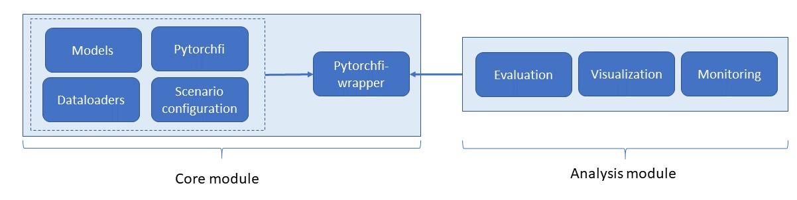

# Pytorch application-level fault injector (pytorch-Alfi)

## Overview

The fault injector tool consists of a **core module** which contains all the functionality to perform a minimum automated fault injection campaign into a given model applied to a given image dataset. Among the different components in the core module, the alficore unit integrates the specified information about model, data set, and fault scenario, and provides the user-executable functions to run the campaign. 

Besides the core unit, the tool provides additional resources for a deeper analysis of the fault injection experiment, which we summarize as **analysis module**. Those features can help to develop a better understanding the behavior of the network in the presence of faults. The analysis module is a collection of both general features (for example, the possibility to monitor the occurences of specific values such as not-a-number (nan) or infinity (inf)) and application-specific convenience features (for example the evaluation and visualization of the output for object detection workloads). 
When enabled, the analysis featurea are automatically integrated through the alficore unit of the core module, that acts as an interface between the core module and the analysis module.
The [Fig. 1](#Schematic) gives an overview of this structure.

<figcaption align = "center"><b> Fig. 1: System overview </b></figcaption>

## Process flow

The workflow is as follows:
- In the scenario.yaml: Specify the type and scope of the injected faults, output directory
- In the alficore.test.py file: 
  - Select an available model and dataset
  - If needed: Adjust pre- and post-processing of model in build_native_model class for custom models and data sets
  - Create a test class Test_class. If needed: Specify parameters related to desired analysis functions
  - Run experiment by executing Test_class.run()
  

The output of the experiment will be saved in the form of:
- A bin file fault.bin containing the used faults
- A result.json containing the output of the network in the absence of faults
- A result_corr.json containing the raw output of the model with faults

TODO: Example

## Scope
Current constraints for the use of the tool are:
- Input has the form of images (i.e. 2-dimensional or 3-dimensional arrays)
- Model has convolutional or fully connected layers in the form of Pytorch modules
- For monitoring: Model features supported activation layers in the form of Pytorch modules 

## Components of the Core Unit
### Scenario configuration

### Models

### Dataloaders

### Pytorchfi

### Pytorchfiwrapper
$$
\alpha=1
$$

